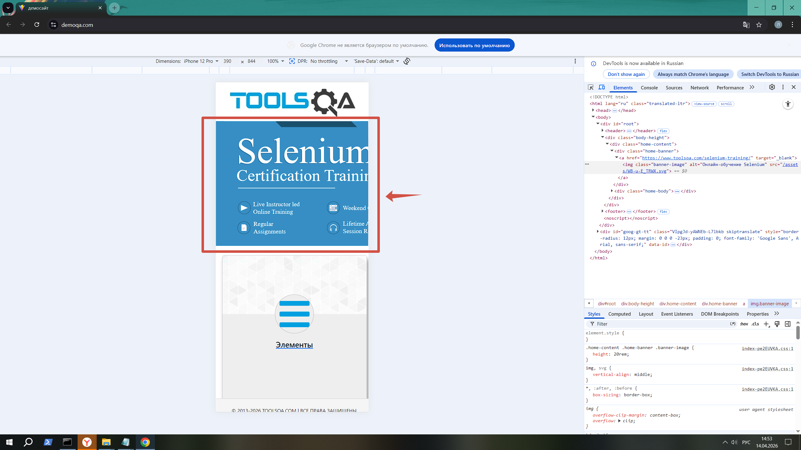

# Баг-репорт: баннер на мобильной версии

Скриншот проблемы:

Описание: Элемент banner-image выходит за пределы экрана...
Заголовок: Баннер (banner-image) некорректно отображается на мобильной версии сайта demoqa.com

Приоритет: Medium (средний)
Сайт не падает, но пользовательский опыт ухудшается.

## Подробная информация

Приоритет: Medium (средний)
Тип: Дефект вёрстки (UI/UX)

## Окружение для воспроизведения

| Параметр| Значение |
|----------|----------|
| Сайт | demoqa.com |
| Устройство | Эмулятор смартфона (iPhone 12 Pro / Pixel 7) |
| Ширина экрана | 390px (или менее 768px) |
| Браузер | Googl (DevTools) |
| ОС | Windows / macOS  |

## Шаги воспроизведения

1. Открыть сайт demoqa.com в браузере Chrome.
2. Нажать F12 (или правой кнопкой → «Просмотреть код»).
3. В DevTools нажать иконку телефона (Toggle device toolbar) или нажать `Ctrl+Shift+M` (Windows) / `Cmd+Shift+M` (Mac).
4. В выпадающем списке устройств выбрать «iPhone 12» или любое другое мобильное устройство.
5. Обратить внимание на элемент с классом `banner-image`.

## Фактический результат (Actual result)

Элемент с классом `banner-image` **выходит за правую границу экрана**. Часть изображения и текста обрезается, появляется горизонтальная прокрутка, хотя она не должна возникать на адаптивном сайте.

## Ожидаемый результат (Expected result)

Элемент с классом `banner-image` полностью помещается в пределах ширины экрана, не требует горизонтальной прокрутки, текст и изображение читаемы без масштабирования.

## Скриншот

На скриншоте видно, что правая часть баннера обрезана/скрыта.

## Дополнительная информация 

Возможная причина: В CSS для класса `.banner-image` задана фиксированная ширина (например, `width: 300px`), а не относительная (`max-width: 100%`), из-за чего элемент не адаптируется под маленький экран.

Проверено также на:
- iPhone SE (375px) — проблема воспроизводится
- iPad Mini (768px) — проблема НЕ воспроизводится (баннер отображается корректно)

## Вывод

Сайт demoqa.com имеет дефект адаптивной вёрстки на мобильных устройствах с шириной экрана менее 768px.