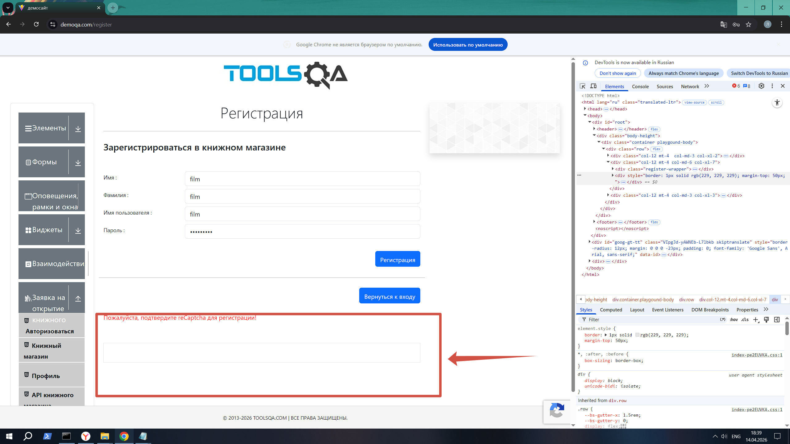

# Баг-репорт: регистрация не проходит при корректно заполненных полях

**Скриншот проблемы:**


**Приоритет:** High (высокий)  
**Тип:** Функциональный дефект

## Описание
При заполнении всех полей формы регистрации на сайте demoqa.com и нажатии кнопки "Register" регистрация не происходит. Пользователь не получает сообщение об ошибке или подтверждение.

## Шаги воспроизведения
1. Открыть https://demoqa.com/register
2. Заполнить поле First Name: `rrr`
3. Заполнить остальные поля любыми валидными данными
4. Нажать кнопку "Register"

**Ожидаемый результат:**  
Регистрация успешно завершается, пользователь перенаправляется на страницу профиля или видит сообщение "Registration successful".

## Скриншот


*На скриншоте видно, что каптча не работает.*

**Фактический результат:**  
Ничего не происходит, не появляется ошибка.

## Технические детали
```html
<!-- Поле существует и принимает значение -->
<input id="firstname" 
       class="mr-sm-2 form-control" 
       type="text" 
       placeholder="First Name" 
       value="rrr" 
       required="" 
       autocomplete="off">