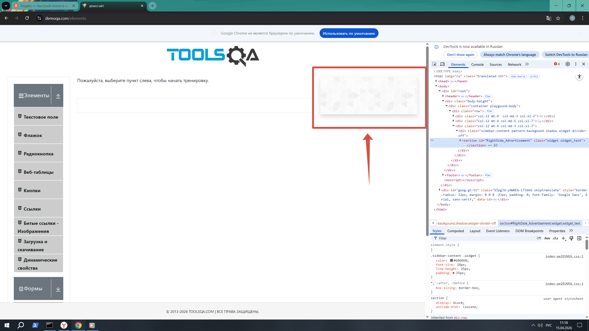

# Баг-репорт: пустой рекламный виджет на всех страницах сайта

**Скриншот проблемы:**


**Приоритет:** Low (низкий)  
**Тип:** UI / Контент

## Описание
На всех страницах сайта demoqa.com (кроме главной) присутствует HTML-блок, предназначенный для отображения рекламы или изображения. Виджет не содержит контента, отображается как пустая область, что создаёт впечатление незавершённости сайта.

## Где проявляется
- **Страницы с виджетом:** `/register`, `/login`, `/profile`, `/books` и другие (все, кроме главной)
- **Локация:** Правая боковая панель (RightSide_Advertisement)

## HTML-код проблемы
```html
<section id="RightSide_Advertisement" class="widget widget_text">
  <div class="Advertisement-Section">
    <div class="Google-Ad">
      <div id="Ad.Plus-300x250-1" class="d-flex justify-content-center" style="margin-bottom: 50px;"></div>
      <div id="Ad.Plus-300x250-2" class="d-flex justify-content-center" style="margin-bottom: 50px;"></div>
    </div>
  </div>
</section>